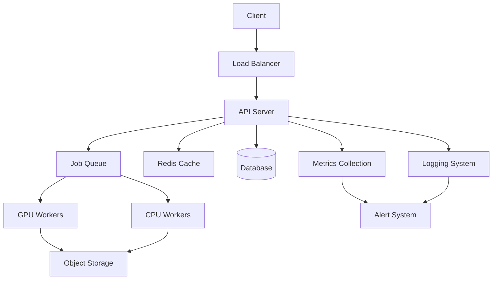

# Architecture Documentation

## System Overview

The Clip Generation Service is a distributed system designed for high-performance video processing and clip generation. The architecture follows a microservices pattern with clear separation of concerns and independent scaling capabilities.

## System Components

### 1. API Layer

- **FastAPI Application**
  - RESTful API endpoints
  - WebSocket support for real-time updates
  - Rate limiting and authentication
  - Request validation and error handling

- **Load Balancer**
  - Request distribution
  - SSL termination
  - Health checking
  - Rate limiting

### 2. Processing Layer

- **GPU Workers**
  - Video processing
  - Frame extraction
  - Quality enhancement
  - Format conversion

- **CPU Workers**
  - Audio processing
  - Metadata extraction
  - Quality analysis
  - Background tasks

### 3. Storage Layer

- **Object Storage**
  - Video files
  - Generated clips
  - Temporary files
  - Backup storage

- **Database**
  - Job metadata
  - User data
  - Quality metrics
  - Analytics data

- **Cache**
  - Job status
  - Processing results
  - Frequently accessed data
  - Session data

### 4. Monitoring Layer

- **Metrics Collection**
  - System metrics
  - Application metrics
  - Business metrics
  - Custom metrics

- **Logging**
  - Application logs
  - Access logs
  - Error logs
  - Audit logs

- **Alerting**
  - Performance alerts
  - Error alerts
  - Capacity alerts
  - Security alerts

## System Architecture Diagram



## Component Details

### API Server

```python
class APIServer:
    def __init__(self):
        self.app = FastAPI()
        self.setup_routes()
        self.setup_middleware()
        self.setup_dependencies()

    def setup_routes(self):
        self.app.include_router(jobs.router)
        self.app.include_router(quality.router)
        self.app.include_router(analytics.router)

    def setup_middleware(self):
        self.app.add_middleware(
            CORSMiddleware,
            allow_origins=settings.CORS_ORIGINS,
            allow_credentials=True,
            allow_methods=["*"],
            allow_headers=["*"],
        )
```

### Job Queue

```python
class JobQueue:
    def __init__(self):
        self.redis = Redis()
        self.processing_queue = "processing"
        self.completed_queue = "completed"
        self.failed_queue = "failed"

    async def enqueue_job(self, job: Job):
        await self.redis.lpush(self.processing_queue, job.json())

    async def process_job(self):
        job_data = await self.redis.rpop(self.processing_queue)
        if job_data:
            job = Job.parse_raw(job_data)
            await self.process(job)
```

### GPU Worker

```python
class GPUWorker:
    def __init__(self):
        self.device = torch.device("cuda")
        self.model = self.load_model()
        self.batch_size = 4

    async def process_batch(self, batch: List[Frame]):
        with torch.cuda.amp.autocast():
            results = self.model(batch)
        return results

    async def process_video(self, video: Video):
        frames = self.extract_frames(video)
        batches = self.create_batches(frames)
        results = []
        for batch in batches:
            result = await self.process_batch(batch)
            results.append(result)
        return self.combine_results(results)
```

## Data Flow

1. **Job Submission**
   ```mermaid
   sequenceDiagram
       Client->>API: Submit job
       API->>Queue: Enqueue job
       Queue->>GPU: Process job
       GPU->>Storage: Save results
       GPU->>API: Update status
       API->>Client: Return job ID
   ```

2. **Quality Analysis**
   ```mermaid
   sequenceDiagram
       API->>CPU: Analyze quality
       CPU->>Storage: Read video
       CPU->>DB: Store metrics
       CPU->>API: Return results
       API->>Client: Return analysis
   ```

## Performance Considerations

### 1. Resource Management

- **GPU Utilization**
  - Batch processing
  - Memory management
  - CUDA optimization
  - Resource limits

- **CPU Utilization**
  - Worker pools
  - Task scheduling
  - Resource allocation
  - Load balancing

### 2. Storage Optimization

- **Caching Strategy**
  - Multi-level cache
  - Cache invalidation
  - Cache warming
  - Cache persistence

- **Data Management**
  - Compression
  - Deduplication
  - Lifecycle policies
  - Backup strategy

### 3. Network Optimization

- **Load Distribution**
  - Geographic distribution
  - CDN integration
  - Connection pooling
  - Keep-alive settings

- **Protocol Optimization**
  - HTTP/2
  - WebSocket
  - Compression
  - Connection reuse

## Security Architecture

### 1. Authentication

```python
class Authentication:
    def __init__(self):
        self.jwt_secret = settings.JWT_SECRET
        self.token_expiry = 3600

    def create_token(self, user: User) -> str:
        payload = {
            "sub": user.id,
            "exp": datetime.utcnow() + timedelta(seconds=self.token_expiry)
        }
        return jwt.encode(payload, self.jwt_secret, algorithm="HS256")

    def verify_token(self, token: str) -> User:
        payload = jwt.decode(token, self.jwt_secret, algorithms=["HS256"])
        return User.get(payload["sub"])
```

### 2. Authorization

```python
class Authorization:
    def __init__(self):
        self.permissions = {
            "admin": ["read", "write", "delete", "manage"],
            "user": ["read", "write"],
            "viewer": ["read"]
        }

    def check_permission(self, user: User, action: str) -> bool:
        user_permissions = self.permissions.get(user.role, [])
        return action in user_permissions
```

### 3. Data Protection

- **Encryption**
  - TLS for transport
  - AES for storage
  - Key management
  - Rotation policies

- **Access Control**
  - Role-based access
  - Resource isolation
  - Audit logging
  - Compliance checks

## Monitoring Architecture

### 1. Metrics Collection

```python
class MetricsCollector:
    def __init__(self):
        self.prometheus = PrometheusClient()
        self.metrics = {
            "request_count": Counter("http_requests_total"),
            "processing_time": Histogram("processing_seconds"),
            "error_count": Counter("error_total"),
            "queue_size": Gauge("queue_size")
        }

    def record_request(self, method: str, status: int):
        self.metrics["request_count"].labels(method=method, status=status).inc()

    def record_processing_time(self, duration: float):
        self.metrics["processing_time"].observe(duration)
```

### 2. Logging System

```python
class LoggingSystem:
    def __init__(self):
        self.logger = logging.getLogger("clip_generation")
        self.setup_handlers()

    def setup_handlers(self):
        # File handler
        file_handler = logging.FileHandler("app.log")
        file_handler.setFormatter(
            logging.Formatter("%(asctime)s - %(name)s - %(levelname)s - %(message)s")
        )
        self.logger.addHandler(file_handler)

        # ELK handler
        elk_handler = ElasticsearchHandler()
        elk_handler.setFormatter(
            logging.Formatter("%(asctime)s - %(name)s - %(levelname)s - %(message)s")
        )
        self.logger.addHandler(elk_handler)
```

### 3. Alert System

```python
class AlertSystem:
    def __init__(self):
        self.rules = self.load_rules()
        self.notifiers = self.setup_notifiers()

    def check_alerts(self):
        for rule in self.rules:
            if rule.evaluate():
                self.notify(rule)

    def notify(self, rule: AlertRule):
        for notifier in self.notifiers:
            notifier.send(rule.message)
```

## Deployment Architecture

### 1. Kubernetes Resources

```yaml
apiVersion: apps/v1
kind: Deployment
metadata:
  name: clip-generation-service
spec:
  replicas: 4
  template:
    spec:
      containers:
      - name: api-server
        resources:
          requests:
            cpu: "4"
            memory: "8Gi"
          limits:
            cpu: "8"
            memory: "16Gi"
      - name: gpu-worker
        resources:
          requests:
            nvidia.com/gpu: 1
            cpu: "8"
            memory: "32Gi"
          limits:
            nvidia.com/gpu: 1
            cpu: "16"
            memory: "64Gi"
```

### 2. Storage Configuration

```yaml
apiVersion: v1
kind: PersistentVolume
metadata:
  name: clip-data-pv
spec:
  capacity:
    storage: 10Ti
  accessModes:
    - ReadWriteMany
  storageClassName: high-performance-ssd
```

### 3. Network Configuration

```yaml
apiVersion: networking.k8s.io/v1
kind: Ingress
metadata:
  name: clip-generation-service
spec:
  rules:
  - host: api.clip-generation-service.com
    http:
      paths:
      - path: /
        pathType: Prefix
        backend:
          service:
            name: clip-generation-service
            port:
              number: 80
```

## Scaling Strategy

### 1. Horizontal Scaling

- **API Layer**
  - Stateless design
  - Load balancing
  - Session management
  - Cache distribution

- **Processing Layer**
  - Worker pools
  - Job distribution
  - Resource allocation
  - Queue management

### 2. Vertical Scaling

- **Resource Limits**
  - CPU allocation
  - Memory allocation
  - GPU utilization
  - Storage capacity

- **Performance Tuning**
  - Application optimization
  - Database tuning
  - Cache optimization
  - Network optimization

### 3. Geographic Scaling

- **Multi-Region Deployment**
  - Region selection
  - Data replication
  - Load distribution
  - Failover handling

- **Edge Computing**
  - CDN integration
  - Edge processing
  - Content delivery
  - Latency optimization 